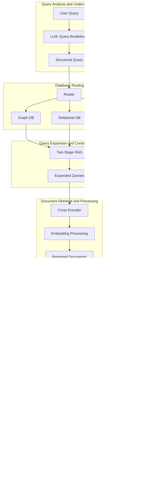

# NanoElectronics Layout Pipeline

To build a `Many Experts Architecture` GenAI application that can take a natural language query and output a nano-electronic silicon layout for chip design, we need to design a comprehensive approach.

This approach will leverage the strengths of various RAG strategies, ensuring efficiency, accuracy, and cost-effectiveness. The pipeline will consist of several key components, including Query Analysis, Database Routing, Query Expansion, Document Retrieval, Knowledge Integration, Layout Generation, and Validation Pipeline.

The `SiliconLayoutEngine`, as so dubbed in this file will use a structured message passing system between the components to ensure seamless data flow and efficient processing. The pipeline will be designed to handle complex queries, generate accurate layouts, and validate the results to ensure quality and reliability.

The goal of this pipeline is to create a tool that acts as an overlay or plugin to common EDA tools, allowing designers to quickly generate nano-electronic silicon layouts based on natural language queries. This will streamline the design process, reduce manual effort, and improve the overall efficiency of chip design.

A typical workflow of the NanoElectronics Layout Pipeline would involve the following steps:

1. **Open New Project in EDA**: The user opens a new project in an EDA tool and initiates the NanoElectronics Layout Pipeline.
2. **Allow Pipeline Access to Project Files**: The pipeline accesses the project files and extracts relevant information about the design requirements, constraints, and specifications.
3. **Human in the Loop**: The user inputs a natural language query related to the layout design, such as "Design a power distribution network for a 7nm chip." The pipeline will then modify the open project to meet the requirements of the query. The user provides periodic feedback on the generated layouts, iterating on the design as needed.
4. **Generate Layout**: When an ideal solution have been achieved the pipeline will use a revision control system to save the layout file and provide it to the user for further processing or validation.

## Step 1: Requirement Analysis

- **Input**: Natural language query.
- **Output**: Nano-electronic silicon layout file compatible with CAD and EDA tools.
- **Knowledge Base**: 1500+ documents from the IMEC knowledge Corpus.
- **Validation**: Pipeline to ensure accuracy of the generated layouts.

## Step 2: Architecture Design

### 2.1 Query Analysis and Understanding

- **Component**: Natural Language Processing (NLP) module.
- **Function**: Convert natural language queries into structured queries.
- **Strategy**: Use an LLM to analyze, rephrase, and decompose the input query.

- Utilize the `fallback` pattern to ensure that if the LLM fails to generate a structured query, a predefined set of rules or a more advanced model can be used as a fallback mechanism. This ensure robustness and reliability in query analysis, while maintaining cost efficiency.

### 2.2 Database Routing

- **Component**: DB Router.
- **Function**: Route queries to the appropriate database (Graph, Relational, Vector).
- **Strategy**: Logical routing using both traditional algorithms and LLM for dynamic routing.

Large amounts of data in this space have strong relationships that can be best represented in a graph database. However, for specific queries, a relational database might be more efficient. The DB Router will intelligently choose the best database based on the query characteristics and historical performance.

Graph databases are particularly useful for representing complex relationships in nano-electronics, such as transistor connections, signal paths, and power distribution networks. Relational databases can be used for structured data like material properties, manufacturing processes, and design specifications. Vector databases can store embeddings for efficient retrieval and similarity search.

### 2.3 Query Expansion and Construction

- **Component**: Query Expansion Module.
- **Function**: Generate multiple variations of the query for comprehensive retrieval.
- **Strategy**: Use a Two-Stage RAG with LLM to create and execute expanded query versions.

The Query Expansion Module will generate variations of the initial query to ensure comprehensive retrieval of relevant information. By using a Two-Stage RAG approach, the system can explore different facets of the query and retrieve a diverse set of documents for processing.

The first stage will focus on expanding the query based on synonyms, context, and related concepts. The second stage will execute these expanded queries against the database to retrieve a wide range of relevant documents.

### 2.4 Document Retrieval and Processing

- **Component**: Cross Encoder and Embedding Layer.
- **Function**: Retrieve relevant documents and process embeddings.
- **Strategy**: Use BERT-based Cross Encoder for embedding and retrieval.

The Cross Encoder will rank the retrieved documents based on their relevance to the query, ensuring that the most informative documents are processed further. The Embedding Layer will process the documents to extract relevant information and context for subsequent stages.

### 2.5 Knowledge Integration

- **Component**: Knowledge Integrator.
- **Function**: Integrate information from multiple retrieved documents.
- **Strategy**: Use a Worker/Researcher Pattern to combine and synthesize information from multiple documents.

The Knowledge Integrator will assign different aspects of the query to multiple workers, each responsible for extracting specific information. The synthesized information will be combined to form a cohesive answer that addresses the query comprehensively. Building a robust knowledge integration system will ensure that the layout generation process is based on accurate and relevant information.

This stage is important for ensuring that the generated layout is based on a comprehensive understanding of the query and the underlying principles of nano-electronics design related to the query, this stage will utilize a cache and Long-Term Memory (LTM) to store and retrieve relevant information for knowledge integration.

### 2.6 Layout Generation

- **Component**: Layout Generator.
- **Function**: Generate nano-electronic silicon layout.
- **Strategy**: Use an LLM specialized in electronic design automation (EDA) to convert synthesized information into a layout file.

The Layout Generator will convert the synthesized information into a silicon layout file compatible with CAD and EDA tools. By leveraging a Model(s) specialized in EDA, the system can ensure that the generated layout meets industry standards and design specifications.

This stage should be broken down into sub-tasks to ensure that the layout generation process is efficient and accurate. The layout generator should be able to handle complex design requirements and constraints, producing high-quality layouts for various nano-electronic applications.

Expand the layout generation process to include a Decision Engine that can dynamically choose the best approach based on the query complexity, intermediate results, and specific requirements. This will enhance the system's adaptability and efficiency in generating accurate layouts.

#### 2.7. Layout Generation with Decision Engine

- **Tool**: Specialized Model(s) for EDA and Decision Engine.
- **Process**:
  - **Decision Points**:
    - Evaluate the complexity of the query.
    - Decide whether to use a basic or advanced layout generation model based on query complexity.
    - Choose between different layout generation techniques based on intermediate results and specific requirements (e.g., speed vs. accuracy).
  - **Execution**:
    - Convert the synthesized information into a silicon layout.
    - The Decision Engine continuously monitors the process and dynamically adjusts parameters, methods, or models to optimize the layout generation.
  - **Output**:
    - Generate the layout in a file format compatible with CAD and EDA tools.

The Validation Pipeline will ensure that the generated layout meets industry standards and specifications. By using a self-corrective RAG approach, the system can validate the layout against known standards, perform error-checking, and correct any discrepancies.

The Validation Engine should be designed to provide feedback on the layout quality and suggest improvements if necessary. This will ensure that the generated layouts are accurate, reliable, and suitable for further design and manufacturing processes.

The Validation Pipeline should also include a feedback mechanism to capture user input on the generated layouts, allowing for continuous improvement and refinement of the layout generation process.

Real-time feedback from the Validation Engine is fed back into the Layout Generator to improve the quality and accuracy of the generated layouts. This closed-loop system ensures that the layout generation process is continuously optimized based on user feedback and validation results.

This stage will have a `fallback` mechanism to ensure that if the validation fails, the system can revert to a previous version or reprocess the layout generation to correct errors.

Use `git` or a similar version control system to track changes in the layout files and ensure that the latest version is always available for further processing or validation.

implements a `rewind` mechanism that allows the system to revert to a previous version of the layout file if the validation process fails. This ensures that errors can be corrected without losing the progress made in the layout generation process.

## Step 3: Detailed Implementation Plan

### 3.1 Query Analysis and Understanding

- **Tool**: LLM (e.g., GPT-4o) with prompt engineering.
- **Process**:
  - User inputs a natural language query.
  - LLM processes the query, breaks it down, and translates it into a structured format.

### 3.2 Database Routing

- **Tool**: Custom Router with LLM integration.
- **Process**:
  - Route the structured query to the appropriate database.
  - Use logic and LLM to dynamically choose between Graph, Relational, and Vector databases.

### 3.3 Query Expansion and Construction

- **Tool**: Two-Stage RAG.
- **Process**:
  - Expand the initial query into multiple variations.
  - Execute each variation against the database.

#### 3.4 Document Retrieval and Processing

- **Tool**: BERT-based Cross Encoder.
- **Process**:
  - Retrieve relevant documents from the IMEC knowledge base.
  - Process documents using Matryoshka embeddings for better context understanding and performance.

#### 3.5 Knowledge Integration

- **Tool**: Worker/Researcher Pattern with LLMs.
- **Process**:
  - Assign different aspects of the query to multiple workers in parallel.
  - Join the threads and then synthesize the information to form a cohesive answer.

#### 3.6 Layout Generation

- **Tool**: Specialized Models for EDA.
- **Process**:
  - Convert the synthesized information into a silicon layout.
  - Output the layout in a file format compatible with CAD and EDA tools.

#### 3.7 Validation Pipeline

- **Tool**: Self-Corrective RAG.
- **Process**:
  - Validate the layout against industry standards and specifications.
  - Perform error-checking and correction if necessary.

### Step 4: Integration and Testing

- **Integration**: Connect all modules and ensure seamless data flow.
- **Testing**:
  - Perform unit testing for each module.
  - Conduct integration testing to ensure the entire system works cohesively.
  - Validate with real-world queries and ensure the accuracy of the generated layouts.

### Step 5: Deployment and Maintenance

- **Deployment**: Deploy the application on a scalable cloud infrastructure.
- **Monitoring**: Continuously monitor performance and accuracy.
- **Maintenance**: Regularly update models and algorithms based on feedback and new data.

### Step 6: User Interface Design

- **UI/UX**: Design an intuitive interface for users to input queries and receive layout files.
- **Features**:
  - Query input box.
  - Real-time progress tracking.
  - Downloadable layout files.
  - Feedback mechanism for continuous improvement.

Integrating a **Decision Engine** into the design will enhance the system's ability to dynamically choose the best approach at various stages, ensuring optimal performance and accuracy. The Decision Engine will be responsible for applying conditional logic to guide the flow of processes based on intermediate outputs and contextual information.

#### Layout Generation with Decision Engine

- **Tool**: Specialized LLM for EDA and Decision Engine.
- **Process**:
  - **Decision Points**:
    - Evaluate the complexity of the query.
    - Decide whether to use a basic or advanced layout generation model based on query complexity.
    - Choose between different layout generation techniques based on intermediate results and specific requirements (e.g., speed vs. accuracy).
  - **Execution**:
    - Convert the synthesized information into a silicon layout.
    - The Decision Engine continuously monitors the process and dynamically adjusts parameters, methods, or models to optimize the layout generation.
  - **Output**:
    - Generate the layout in a file format compatible with CAD and EDA tools.

### Decision Engine Implementation Details

**Decision Points**:

- **Query Complexity Evaluation**: Assess the complexity of the user's query to decide the depth of processing required.
  - **Simple Queries**: Use a basic model to generate the layout quickly.
  - **Complex Queries**: Engage a more sophisticated model or a combination of models for higher accuracy.
  
- **Intermediate Results Analysis**: After each step, analyze the results to decide the next best step.
  - If the initial document retrieval yields insufficient information, trigger additional queries or use different retrieval strategies.
  - If the synthesis phase shows gaps or inconsistencies, reroute to alternative synthesis methods or additional information sources.

- **Layout Generation Techniques**:
  - **Basic Technique**: Use predefined templates and simpler algorithms for straightforward designs.
  - **Advanced Technique**: Engage detailed and complex algorithms for intricate designs, incorporating user-specific requirements and constraints.

**Decision Criteria**:

- **Relevance and Accuracy**: Continuously evaluate the relevance and accuracy of the intermediate outputs.
- **Resource Utilization**: Monitor the computational and network resources being used and adjust the strategy to balance efficiency and performance.
- **Time Constraints**: Consider the urgency of the query and adjust the processing speed accordingly.

### Integration and Testing

**Integration**:

- Ensure the Decision Engine is seamlessly integrated with all components, allowing it to dynamically influence each step of the process.
- Implement feedback loops where the Decision Engine can adjust parameters in real-time based on outputs.

**Testing**:

- Perform extensive unit testing for each decision point to ensure logical correctness and robustness.
- Conduct integration testing to validate that the Decision Engine effectively enhances the overall system performance.
- Validate with real-world queries to ensure the system meets the required accuracy and efficiency.

### Deployment and Maintenance

**Deployment**:

- Deploy the application on a scalable cloud infrastructure with the capability to handle dynamic decision-making processes.

**Monitoring and Maintenance**:

- Continuously monitor the performance of the Decision Engine and the overall system.
- Regularly update models, decision criteria, and algorithms based on performance data and user feedback.

### User Interface Design

**UI/UX**:

- Design an intuitive interface that allows users to input queries and receive layout files.
- Include features for real-time progress tracking, detailed feedback on decision points, and options to customize the decision criteria (e.g., prioritize speed over accuracy).

By integrating the Decision Engine into the Many Experts Architecture GenAI application, you can create a highly adaptive and efficient system for generating nano-electronic silicon layouts. This approach leverages dynamic decision-making to optimize performance and ensure the highest accuracy in the generated designs.

`High-Level Architecture Diagram`:

