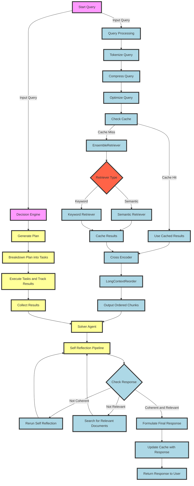

# GenAI Pipeline

## Introduction

The GenAI Pipeline is a pipeline that is designed to be a more efficient and effective pipeline for the Agentic-RAG model. The pipeline is designed to be more efficient by reducing the amount of noise in the response, increasing the relevancy of the response, and increasing the faithfulness of the response. The pipeline is designed to be more effective by increasing the speed of the response, increasing the accuracy of the response, and increasing the diversity of the response.

At a high-level the GenAI Pipeline is a `Decision Engine` that is designed to take in a query and return a response.

## Pipeline

The GenAI Pipeline is broken up into the following stages:

### **Query Processing**

The Query Processing stage is responsible for taking in a query and processing it into a format that can be used by the rest of the pipeline. This stage is responsible for tokenizing the query, compressing the query, and optimizing the query.

We utilize an `EnsembleRetriever` for a hybrid key-word and semantic based retrieval.

`Semantic Retriever`: This retriever is responsible for retrieving documents that are semantically similar to the query.

- Utilizes ParentDocumentRetriever as root, MultiQueryRetriever, Self-Querying, and ContextualCompressionRetriever: CharacterTextSplitter->EmbeddingsRedundantFilter->EmbeddingsFilter = DocumentCompressorPipeline as a compressor.

`Keyword Retriever`: This retriever is responsible for retrieving documents that contain the keywords in the query.

- BM25Retriever is used as the keyword retriever.
- Cache the results of the retriever for future use.
- For Long Term Memory, we use the above query analysis with an additional Time-Weighted vector store retriever, as well as a cache for the Time-Weighted vector store retriever.
- we hit the caches first, perform the query analysis, and then cache the results for future use.
  - If the cache is not relevant to the query, we hit the main databases.
- The output of this stage is a list of chunks that are unordered and with varying degrees of relevancy to the query.

   1. **Cross Encoder**: The Cross Encoder stage is responsible for taking in the chunks from the Query Processing stage and ranking them based on their relevance to the query. This stage is responsible for taking in the chunks and the query and returning a list of chunks that are highly relevant to the query.
       - We utilize a CrossEncoder to rank the chunks based on their relevance to the query. Retrieves the top 5 chunks.
       - Utilizes a LongContextReorder to reorder the chunks based on the context of the query, in order to prevent the `Lost In the Middle Problem`.
       - The output of this stage is a list of ordered chunks that are highly relevant to the query.

### **Decision Engine**

The Decision Engine stage is responsible for taking the initial user query and generating a plan to execute the query.

- The decision engine uses ReWOO to generate a plan with variable substitution, then breaks down the plan into tasks, and finally executes the tasks while taking the result of one task and using it as input for the next task if there is a dependency.
- Ingest the query and spawn two parallel pipelines: one for the Query Processing stage and one for the Decision Engine stage.
  - `Query Processing Pipeline`:
    - Tokenize the query.
    - Compress the query.
    - Optimize the query.
    - Determine if Long Term Memory is needed, and if so, retrieve/update the relevant documents.
    - Retrieve the top 5 chunks.
  - `Decision Engine Pipeline`:
       1. Generate step-by-step plan to execute the query.
       2. Breakdown the plan into tasks.
       3. Execute the tasks and track results, update the plan if necessary.
       4. Collect the results and pass them to a Solver.
       5. Solver Agent: The Solver Agent is a Self Reflection stage responsible for taking in the ordered chunks from the Query Processing Pipeline and the result of the `Decision Engine`'s previous step, then generating a response. This stage is responsible for generating a response that is coherent and relevant to the query.
           - We utilize a Self Reflection pipeline to generate a response based on the ordered chunks.
           - Utilizes tools such as web search, api calls, and other tools to construct a response.
             - Here we check the response for relevancy, if it answers the question, and if it is coherent.
               - If the response is not coherent, we re-run the Self Reflection pipeline.
               - If the input chunk is not relevant, we use search tools to find relevant documents and re-run the Self Reflection pipeline.
               - If the response is coherent, relevant, and answers the question, we return the response and update the cache with the query and the answer to use as an example later.
       6. Formulate the response and return it to the user.

## Charts

```mermaid
graph LR
    A(Input Query) --> B(Generate Multiple Queries)
    B -->|Each query variant| C(Quick Search Using Low-Dimension Vector)
    C --> D1[Filter Results Based on Initial Scoring]
    D1 --> D2[Identify Top N Results]
    D2 --> E(Re-Rank Results Using High-Dimension Vector)
    E --> F1[Apply Advanced Scoring Metrics]
    F1 --> F2[Sort Documents by Relevance]
    F2 --> G(Return Documents)
```

